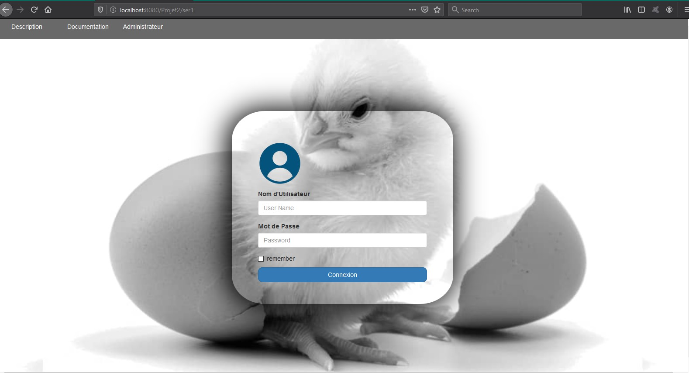
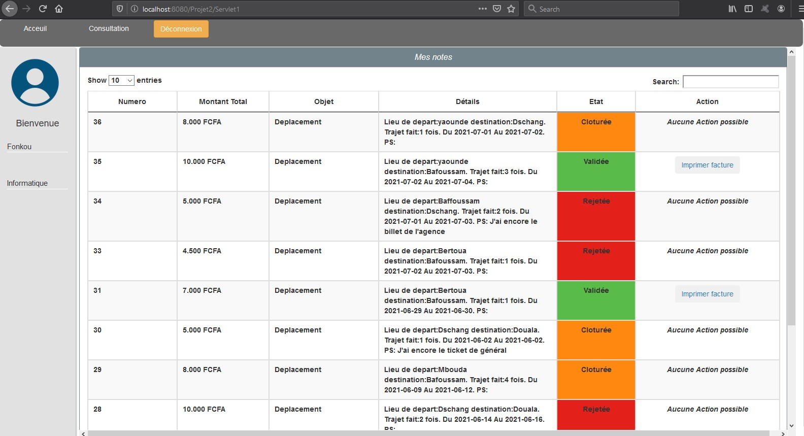

# Application Web de Gestion des Notes de Frais (Société des Provenderies du Cameroun)
<p align="center">
 </div>
</p>

L'application doit permettre d'enregistrer tout frais engagé, aussi bien pour l'activité directe (déplacement, restauration et hébergement) que pour les activités annexes (événementiel, conférences, autres), et de présenter un suivi des opérations menées par le service comptable (réception des pièces, validation de la demande de remboursement, mise en paiement, remboursement effectué).

<p align="center">
 </div>
</p>

## TECHNOLOGIES UTILISEES
* Core Java
* JavaEE
* Javax.mail (Après envoi d'une note de frais un mail est envoyé)
* MySQL

# Guide d'installation
Pour plus d'informations contactez Tamaroas Dev sur facebook ou envoyez moi un Mail (<b>martialkom123@gmail.com</b>)

## Paramètres de la base de données
* Ouvrir MySQL et créer une nouvelle base de données nommée NoteDeFrais
* Importez maintenant scriptNote.sql dans la nouvelle base de données
* Ou vous pouvez créer les tables manuellement
```sql

CREATE TABLE IF NOT EXISTS `NoteDeFrais`.`Utilisateurs` (
 
  `nom` VARCHAR(45) NOT NULL,
  `prenom` VARCHAR(45) NOT NULL,
  `login` VARCHAR(45) NOT NULL,
  `mot_de_passe` VARCHAR(255) NOT NULL,
  `type` VARCHAR(45) NOT NULL
  )
ENGINE = InnoDB;

CREATE TABLE IF NOT EXISTS `NoteDeFrais`.`Employe` (
  `idEmploye` INT NOT NULL,
  `nom` VARCHAR(45) NOT NULL,
  `prenom` VARCHAR(45) NOT NULL,
  `login` VARCHAR(45) NOT NULL,
  `mot_de_passe` VARCHAR(255) NOT NULL,
  `departement` VARCHAR(45) NOT NULL
    )
ENGINE = InnoDB;

CREATE TABLE IF NOT EXISTS `NoteDeFrais`.`service_comptable` (
  `idservice_comptable` INT NOT NULL,
  `nom` VARCHAR(45) NOT NULL,
  `prenom` VARCHAR(45) NOT NULL,
  `login` VARCHAR(45) NOT NULL,
  `mot_de_passe` VARCHAR(255) NULL)
ENGINE = InnoDB;

CREATE TABLE IF NOT EXISTS `NoteDeFrais`.`Note` (
  `Numero` INT NOT NULL AUTO_INCREMENT,
  `montantTotal` FLOAT NOT NULL,
  `details` VARCHAR(255) NULL,
  `etat` VARCHAR(25) NULL DEFAULT 'Ouvert',
  `objet` VARCHAR(255) NOT NULL,
  `id_U` INT NOT NULL,
  `date` DATE NOT NULL,
  `montantV` FLOAT default 0.0, primary key(`Numero`))
ENGINE = InnoDB;

CREATE TABLE IF NOT EXISTS `NoteDeFrais`.`Administrateur` (
  `nom` VARCHAR(20) NOT NULL,
  `login` VARCHAR(45) NOT NULL,
  `mot_de_passe` VARCHAR(255) NOT NULL
  )
ENGINE = InnoDB;


CREATE TABLE IF NOT EXISTS `NoteDeFrais`.`connectedUser` (
  `Login` INT NOT NULL,
  `nom` VARCHAR(45) NOT NULL
)
ENGINE = InnoDB;


-- -----------------------------------------------------
-- function connexion
-- -----------------------------------------------------
set global log_bin_trust_function_creators=1;
DELIMITER $$
USE `NoteDeFrais`$$
create function connexion (mdp varchar(40), utilisateur varchar(40)) returns integer
BEGIN
declare pass varchar(255);
     declare mdp_MD5 varchar(255);
     declare i int;
     select mot_de_passe into pass from Utilisateurs where login=utilisateur;
     select MD5(mdp) into mdp_MD5;
     if mdp_MD5=pass then
     set i=1;
     else
     set i=0;
     end if;
     return i;
END$$

delimiter $$
create function connexionAd (mdp varchar(40), utilisateur varchar(40)) returns integer
BEGIN
declare pass varchar(255);
     declare mdp_MD5 varchar(255);
     declare i int;
     select mot_de_passe into pass from administrateur where login=utilisateur;
     select MD5(mdp) into mdp_MD5;
     if mdp_MD5=pass then
     set i=1;
     else
     set i=0;
     end if;
     return i;
END$$

create trigger afterUpdateUtilisateur after update on utilisateurs for each row
begin
declare t varchar(15);
select type into t from utilisateurs where login=old.login;

update employe set login=new.login, nom=new.nom, prenom=new.prenom, mot_de_passe=new.mot_de_passe where login=old.login;

update service_comptable set login=new.login, nom=new.nom, prenom=new.prenom, mot_de_passe=new.mot_de_passe where login=old.login;

update note set login=new.login where login=old.login;

end$$

Delimiter $$
CREATE  TRIGGER user_BEFORE_INSERT BEFORE INSERT ON utilisateurs FOR EACH ROW
BEGIN
if(new.login in(select login from utilisateurs)) then
    SIGNAL SQLSTATE '45000' SET MESSAGE_TEXT = "Cet utilisateur existe deja";
     end if;
     end$$


```

* Ouvrez src/com.octest.forms/Dbconnection.java et inserez les paramètres de votre BD
```java
public class Dbconnection {
public static  Connection connexion=null;
public static  Statement statement=null;
	
	public static void connecter() {
		String lien="jdbc:mysql://localhost:3306/NoteDeFrais";
		String user="root";
		String pass="";
		try {
			Class.forName("com.mysql.jdbc.Driver");
		} catch (ClassNotFoundException e1) {
		
		}
		try {
			connexion=DriverManager.getConnection(lien, user, pass);
		} catch (SQLException e1) {
			
		}
		
		try {
			statement=connexion.createStatement();
		}catch(SQLException e) {
			
		}
	
		 
	}

}

```

## Paramètres de l'envoi de mail (En réseau local)

* Télécharger Hmail server administrator (serveur de mail)
* Créer un domaine avec Hmail
* Configurer le serveur SMTP avec Hmail
* Installer une application de messagerie (Outlook, Thunderbird….) 
* Configurer le client de message sur l'application installé

* API JavaMail:  http://java.sun.com/products/javamail

* Ouvrez src/com.octest.forms/Envoi.java et changez les adresses 

```java

public class Envoi {

	public static int main(String[] args) {
		
		String smtpServer = "127.0.0.1"; //Adresse du serveur smtp de Hmail
		String from = "admin@localserver.com"; //A changer
		String to = "accounts@localserver.com"; // A changer
		String objet = "Nouvelle Note de la SPC";
		String texte = "Le message qui doit se trouver dans le mail!!!";
		Properties props = System.getProperties(); 
		props.put("mail.smtp.host", smtpServer);
		Session session = Session.getDefaultInstance(props, null);
		Message msg = new MimeMessage(session); 
		
		try {
		      msg.setFrom(new InternetAddress(from));
		      msg.setRecipients(Message.RecipientType.TO,InternetAddress.parse(to, false));
		      msg.setSubject(objet);
		      msg.setText(texte);
		      msg.setHeader("X-Mailer", "LOTONtechEmail");
		      Transport.send(msg);
		      return 1;
		}
		catch (AddressException e) {
		    return 0;
		} 
		catch (MessagingException e) {
			return 0;
		}
		
```
